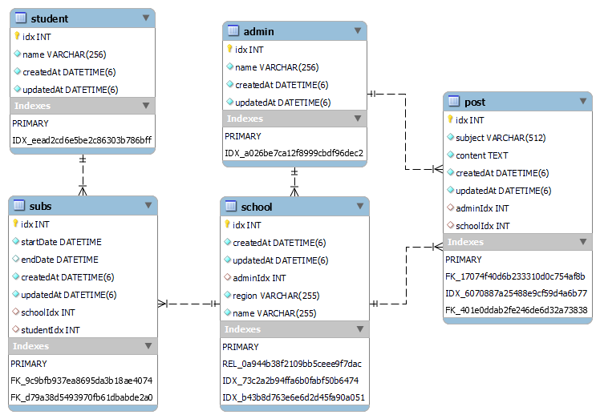

## Typescript, TypeORM 스터디를 위한 뉴스피드 API 만들기

##### 내용
* __구성__
    * Typescript, Node.js, MySQL, TypeORM 세팅
    * TypeORM Entity 구성
* __API__
    * router 
    * controller / service
* __문서화__
    * swagger API 작성
* __테스트__
    * mocha, chai, supertest 세팅
    * 샘플 테스트 작성
    * 테스트 작성

- - -

#### 스택
* Node.js
* Typescript
* express.js
* nodemon
* ts-node
* MySQL / TypeORM
* mocha / chai / supertest
* Swagger-UI

- - -

#### 기능

* 학교 등록
* 학교 소식 작성/수정/삭제
* 학교 구독
* 구독 목록 확인/취소

- - -

#### ERD

- - -

#### API 문서

* /api-docs 에서 swaggerUI로 확인
